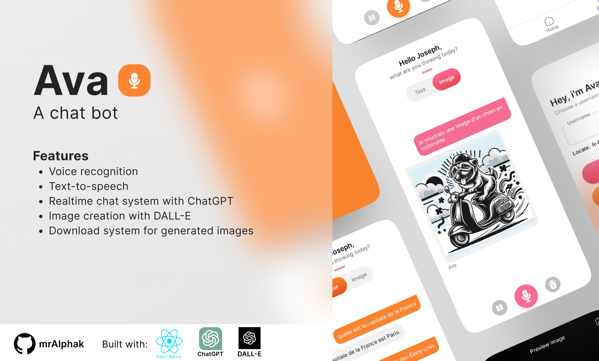

# Ava, a chat bot 🤖

This is a chat bot built with React Native, Chatgpt and Dall-e. 

# Features:
- Voice recognition
- Text-to-speech
- Realtime chat system with Chatgpt
- Image creation with Dall-e
- Download system for generated images

The app utilizes various libraries and components such as React Navigation, Reanimated, Expo and more!
Feel free to modify and enhance the app according to your needs!

# Prerequisites:
- Node.js: Visit the official Node.js website and follow the instructions to install the latest LTS version of Node.js.
- NPM (Node Package Manager): NPM is automatically installed with Node.js.
- Xcode (for macOS) or Android Studio (for Windows/Linux): Depending on your target platform
- A OpenAi account (Make sure to have available credits)

# Installation Steps:
- Clone the repository
- Install dependencies: Run `npm install`
- For ios users: Run `pod install`
- Replace your OpenAi credential into the env file
- Start the expo development server: `npm run start`
- Build and run the app: `npm run android` or `npm run ios`

Enjoy coding! 🚀

----------------------

https://www.linkedin.com/in/aka-joseph/ ,
https://github.com/mrAlphak